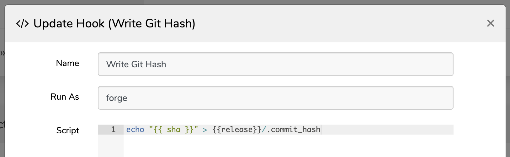
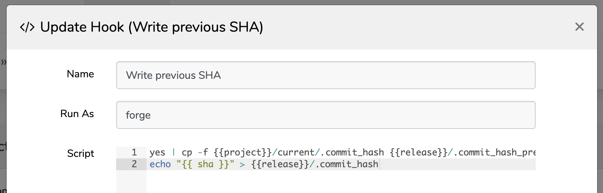
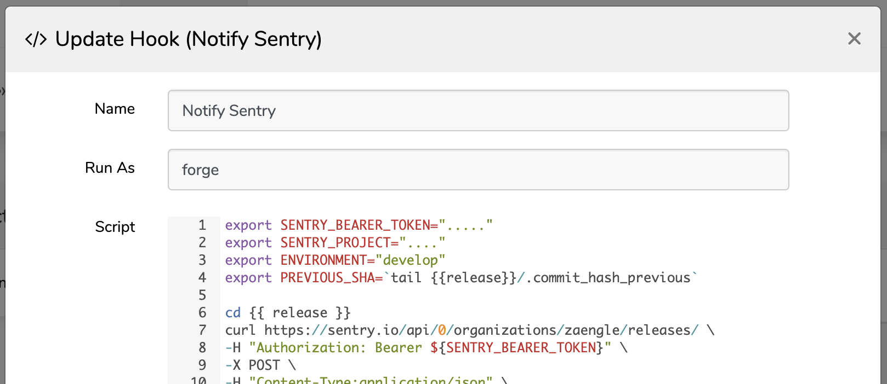

# Envoyer Sentry Release Notifier
This tool helps with the process of collecting commits and sending them to Sentry as a new release while deploying from [Laravel Envoyer](https://envoyer.io/).

Sentry can associate a series of git commits to a release by providing a starting hash and ending hash. With Envoyer it can be a bit tricky since the `.git` repository isn't deployed with the site. By using the following combination of deployment hooks we are able to capture the two required hashes and gain the benefits of commit tracking in Sentry.

## Installation

`composer require zaengle/envoyer-sentry-release-notifier`

## Sentry Config

Inside your `config/sentry.php` file add the `getCommitHash()` helper provided by this package.

```php
<?php

use Zaengle\EnvoyerSentryReleaseNotifier\EnvoyerSentryReleaseNotifier;

return [
    // capture release as git sha
    'release' => app(EnvoyerSentryReleaseNotifier::class)->getCommitHash(),
    
    // rest of config...
];
```

## Envoyer Hooks
Once your project is set up with Sentry, add the following deployment hooks to Envoyer. **You will need to run one deployment with _only the `Write Git Hash` hook enabled_ so that your initial `.commit_hash` file will be present for future releases.**

## Activate New Release : AFTER


After Envoyer activates a new release we need to write the hash to a file so it's available for the next release, where it will be used as the `commit_hash_previous`"

```shell script
echo "{{ sha }}" > {{release}}/.commit_hash
```
**NOTE** - This command will need to be run one time before activating any of the other hooks so the initial `.commit_hash` file is created for subsequent steps.

## Clone New Release : AFTER


```shell script
yes | cp -f {{project}}/current/.commit_hash {{release}}/.commit_hash_previous
echo "{{ sha }}" > {{release}}/.commit_hash
```

## Purge Old Releases : AFTER


```shell script
export GIT_REPO="zaengle/my-sentry-project-name"
export ENVIRONMENT="develop"
export PREVIOUS_SHA=`tail {{release}}/.commit_hash_previous`
export SENTRY_ORG="zaengle"
export SENTRY_BEARER_TOKEN="MyBearerToken"
export SENTRY_PROJECT="my-sentry-project-name"

cd {{ release }}
curl https://sentry.io/api/0/organizations/${SENTRY_ORG}/releases/ \
-H "Authorization: Bearer ${SENTRY_BEARER_TOKEN}" \
-X POST \
-H "Content-Type:application/json" \
-d "{
    \"environment\":\"${ENVIRONMENT}\",
    \"version\":\"{{sha}}\",
    \"refs\":[{
        \"repository\":\"${GIT_REPO}\",
        \"commit\":\"{{sha}}\",
        \"previousCommit\": \"${PREVIOUS_SHA}\"
    }],
    \"projects\": [\"${SENTRY_PROJECT}\"]
}"

curl https://sentry.io/api/0/organizations/${SENTRY_ORG}/releases/{{sha}}/deploys/ \
-X POST \
-H "Authorization: Bearer ${SENTRY_BEARER_TOKEN}" \
-H 'Content-Type: application/json' \
-d "
{
    \"environment\": \"${ENVIRONMENT}\",
    \"name\": \"{{release}}\"
}"
```

_Note_: Sentry deploy names are limited to 64 characters. Depending on the length of your projects domain name and release path you might receive the following error.

```
{"name":["Ensure this field has no more than 64 characters."]}
```

If so, update the deployment script to send the `{{time}}` instead of the `{{release}}`.

```diff
...
{
    \"environment\": \"${ENVIRONMENT}\",
-    \"name\": \"{{release}}\"
+    \"name\": \"{{time}}\"
}"
```

## License

The MIT License (MIT). Please see [License File](LICENSE.md) for more information.

## Credits

- [Original blog article](https://humaan.com/blog/tracking-envoyer-releases-in-sentry/)
- [Discussion forum post](https://forum.sentry.io/t/sentry-io-all-commits-associated-to-all-releases/3892)
